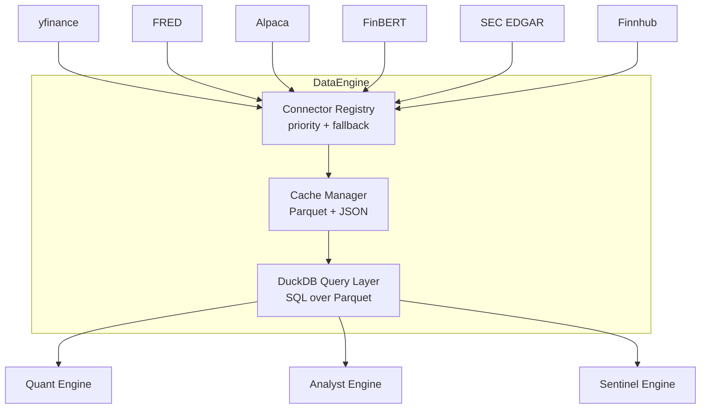

# Phase 1: Data Ingestion Engine

## Architecture Overview
The Data Ingestion Engine abstracts all external API calls into a single `DataEngine` class.

All downstream systems (Quant, Analyst, Sentinel) call this engine, which routes the request to the correct connector, caches the result locally, and provides DuckDB SQL access to the cached data.

## Connector Implementations
1. **yfinance** (Priority 1): Primary for prices, options, financials, insiders, news.
2. **FRED** (Priority 1): Fed funds rate, 10Y treasury, CPI, unemployment.
3. **FinBERT** (Priority 1): Local Hugging Face NLP model to score text sentiment.
4. **SEC EDGAR** (Priority 1): 10-K/10-Q filing retrieval and text extraction.
5. **Finnhub** (Priority 1): Earnings transcripts, news calendar.
6. **Alpaca** (Priority 2): Fallback for prices, primary for paper trade execution.

## Storage Layer
- **Parquet:** Time-series arrays (OHLCV prices).
- **JSON:** Point-in-time snapshots (fundamentals, macro state).
- **DuckDB:** In-memory SQL engine bridging Parquet files.
