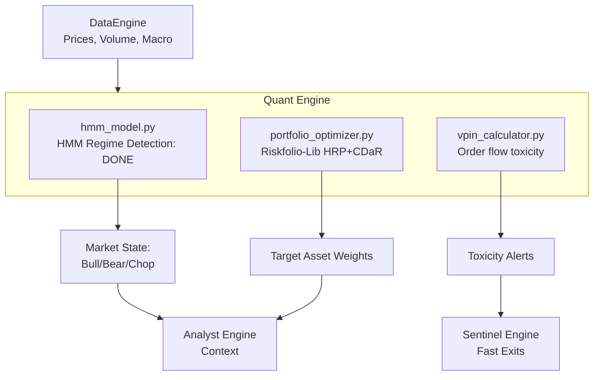

# Phase 2: Quant Engine — Build Plan

## Goal Description
The **Quant Engine** is the mathematical core of the Aegis system. It has three primary responsibilities:
1. **Regime Detection:** Determine if the market is in a Bull, Bear, or Volatile state using Hidden Markov Models (HMM). (Done)
2. **Portfolio Optimization:** Allocate capital dynamically using Hierarchical Risk Parity (HRP) and Conditional Drawdown at Risk (CDaR) constraints, discarding simplistic static weightings.
3. **Order Flow Toxicity (VPIN):** Measure the Volume-Synchronized Probability of Informed Trading to flag when institutional dumping is occurring before price fully reacts.

All components will pull data exclusively through the existing `DataEngine`.

---

## 🔬 Component 2 Deep Dive: Portfolio Optimization

### Architecture (`engines/quant/portfolio_optimizer.py`)
We will use `riskfolio-lib` to allocate weights to a basket of assets.
- **Methods:**
  - `Hierarchical Risk Parity (HRP):` Uses machine learning (hierarchical tree clustering) to group correlated assets and allocate risk equally across the clusters. This is far more robust to out-of-sample market shocks than traditional Markowitz Mean-Variance optimization.
  - `Mean-Risk Optimization (CDaR):` Traditional convex optimization using Conditional Drawdown at Risk to minimize the worst-case drawdowns.
- **Observable Inputs:** 
  1. Historical prices matrix returned by `DataEngine.query_prices(tickers)`.
- **Class Structure:**
  - `RiskfolioOptimizer.train(df)`: No explicit training required for HRP since it clusters in a single pass over the covariance matrix.
  - `RiskfolioOptimizer.predict(df)`: Runs the clustering and returns the exact target `%` weights for each ticker.

### Testing Plan (`tests/unit/test_portfolio_optimizer.py`)

#### 1. Unit Test (Synthetic Data)
- Generate a fake Pandas price matrix with 2 highly correlated assets (A, B) and 1 completely uncorrelated asset (C).
- **Assertion:** HRP should recognize A and B are correlated, group them into a cluster, and allocate `50%` of the portfolio to C, and split the remaining `50%` between A and B (`25%` each). This proves the clustering math is doing its job instead of blindly giving 33% to everything.

#### 2. Validation Test (Real Data)
- Use `DataEngine` to pull real `AAPL`, `MSFT`, `GLD` (Gold), and `TLT` (Treasuries) over the last 2 years.
- **Assertion:** The optimizer should naturally assign higher weight to `GLD` and `TLT` during high-volatility periods, and smoothly adjust weights between `AAPL`/`MSFT` based on their covariance.

---

## Architecture Context

## Proposed Changes
- Create `engines/quant/portfolio_optimizer.py`.
- Create `tests/unit/test_portfolio_optimizer.py` and implement the synthetic and historical correlation tests.
