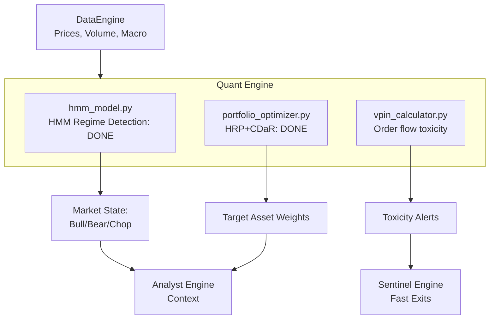

# Phase 2: Quant Engine — Build Plan

## Goal Description
The **Quant Engine** is the mathematical core of the Aegis system. It has three primary responsibilities:
1. **Regime Detection:** Determine if the market is in a Bull, Bear, or Volatile state using Hidden Markov Models (HMM). (Done)
2. **Portfolio Optimization:** Allocate capital dynamically using Hierarchical Risk Parity (HRP) and Conditional Drawdown at Risk (CDaR) constraints, discarding simplistic static weightings. (Done)
3. **Order Flow Toxicity (VPIN):** Measure the Volume-Synchronized Probability of Informed Trading to flag when institutional dumping is occurring before price fully reacts.

All components will pull data exclusively through the existing `DataEngine`.

---

## 🔬 Component 3 Deep Dive: VPIN Order Flow Toxicity

### Architecture (`engines/quant/vpin_calculator.py`)
We will calculate the Volume-Synchronized Probability of Informed Trading (VPIN) based on the model by Easley, Lopez de Prado, and O'Hara (2012). VPIN measures the imbalance between buy and sell volume in volume-synchronized time buckets. High VPIN indicates a high probability of informed trading (toxic order flow), often preceding price crashes.

- **Observable Inputs:** 
  1. High-resolution intraday historical prices (1-minute or 5-minute bars) returned by `DataEngine.get_prices(ticker, interval="1m")`.
- **Methodology:**
  1. Time bars are binned into Volume Buckets (so buckets group time periods with equal volume).
  2. Buy and Sell volume within each bucket is estimated (bulk volume classification e.g. using price changes).
  3. Absolute volume imbalance is calculated across a rolling window of buckets.
  4. VPIN = sum(|Buy Volume - Sell Volume|) / (Bucket Volume * Number of Buckets).
- **Class Structure:**
  - `VPINCalculator.train(df)`: No ML training required. Can be used to find historical VPIN distribution to set dynamic thresholds.
  - `VPINCalculator.predict(df)`: Processes recent intraday data to compute the current VPIN value and returns a toxicity flag if it exceeds a critical threshold (e.g. > 0.8).

### Testing Plan (`tests/unit/test_vpin_calculator.py`)

#### 1. Unit Test (Synthetic Data)
- Generate a fake Pandas price matrix of 1-minute bars.
  - Part A: Random walk with balanced volume.
  - Part B: Sudden drop in price with massive volume (simulated toxic selling).
- **Assertion:** VPIN should be low/stable during Part A and spike significantly during Part B, proving the volume bucket and imbalance math works.

#### 2. Validation Test (Real Data)
- Use `DataEngine` to pull real 1-minute intraday data for `SPY` or `AAPL` for the last 5 days.
- **Assertion:** The calculator successfully bins the real data into volume buckets, computes VPIN without throwing errors due to missing data or zero volume bars, and returns a valid VPIN score between 0 and 1.

---

## Architecture Context

## Proposed Changes
- Create `engines/quant/vpin_calculator.py`.
- Create `tests/unit/test_vpin_calculator.py` and implement the synthetic and historical tests.
