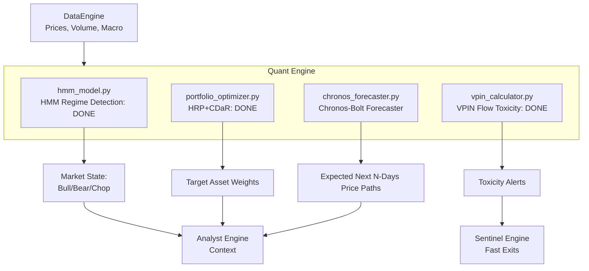

# Phase 2: Quant Engine — Build Plan

## Goal Description
The **Quant Engine** is the mathematical core of the Aegis system. It has four primary responsibilities:
1. **Regime Detection:** Determine if the market is in a Bull, Bear, or Volatile state using Hidden Markov Models (HMM). (Done)
2. **Portfolio Optimization:** Allocate capital dynamically using Hierarchical Risk Parity (HRP) and Conditional Drawdown at Risk (CDaR) constraints, discarding simplistic static weightings. (Done)
3. **Order Flow Toxicity (VPIN):** Measure the Volume-Synchronized Probability of Informed Trading to flag when institutional dumping is occurring before price fully reacts. (Done)
4. **Price Forecasting (Chronos-Bolt):** Predict the future distribution of prices using Amazon's advanced time-series language model.

All components will pull data exclusively through the existing `DataEngine`.

---

## 🔬 Component 4 Deep Dive: Chronos-Bolt Price Forecasting

### Architecture (`engines/quant/chronos_forecaster.py`)
We will use Amazon's `chronos-bolt-base` model. Chronos represents a radical architectural shift by treating time-series forecasting as a language modeling problem using a T5 transformer. It tokenizes historical price data and predicts the next tokens in the sequence, achieving exceptional zero-shot forecasting without needing to train a custom model from scratch.

- **Dependencies:** `chronos` (from huggingface/github), `torch`, `transformers`.
- **Observable Inputs:** 
  1. Historical daily or hourly prices (e.g. `SPY` closing prices) returned by `DataEngine.get_prices()`.
- **Methodology:**
  1. Convert the historical price series into a PyTorch tensor.
  2. Pass it through the `ChronosPipeline` using the `amazon/chronos-bolt-base` checkpoint.
  3. Generate a multi-step forecast (e.g., predicting the next 7 or 14 days).
  4. Extract the median forecasted path and the 10th/90th percentile confidence intervals.
- **Class Structure:**
  - `ChronosForecaster.train(df)`: No ML training required (zero-shot model).
  - `ChronosForecaster.predict(df)`: Processes recent historical data and returns a dictionary with the specific forecasted target prices (median, upper bound, lower bound) for the specified horizon.

### Testing Plan (`tests/unit/test_chronos_forecaster.py`)

#### 1. Unit Test (Synthetic Data)
- Generate a fake Pandas price matrix of daily bars that exhibits a very clear, rigid upward linear trend.
- **Assertion:** Feed the synthetic trend into Chronos-Bolt and predict the next 5 days. Assert that the forecasted median path correctly identifies the upward trajectory and continues the trend.

#### 2. Validation Test (Real Data)
- Use `DataEngine` to pull real daily data for `SPY` for the last 90 days.
- **Assertion:** Set the prediction horizon to 7 days. Verify that the pipeline executes completely without memory errors, correctly returns median, lower, and upper bound arrays of exactly length 7, and the predicted median is within a mathematically reasonable percentage of the final known price.

---

## Architecture Context

## Proposed Changes
- Create `engines/quant/chronos_forecaster.py`.
- Create `tests/unit/test_chronos_forecaster.py` and implement the synthetic and historical structural tests.
