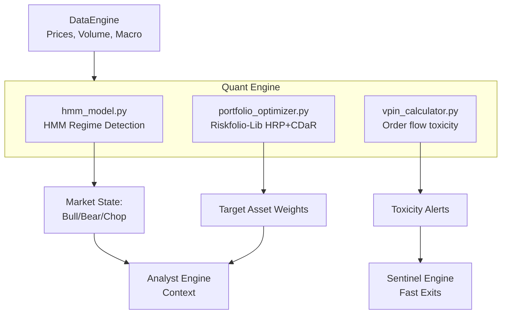

# Phase 2: Quant Engine — Build Plan

## Goal Description
The **Quant Engine** is the mathematical core of the Aegis system. It has three primary responsibilities:
1. **Regime Detection:** Determine if the market is in a Bull, Bear, or Volatile state using Hidden Markov Models (HMM).
2. **Portfolio Optimization:** Allocate capital dynamically using Hierarchical Risk Parity (HRP) and Conditional Drawdown at Risk (CDaR) constraints, discarding simplistic static weightings.
3. **Order Flow Toxicity (VPIN):** Measure the Volume-Synchronized Probability of Informed Trading to flag when institutional dumping is occurring before price fully reacts.

All components will pull data exclusively through the existing `DataEngine`.

---

## 🔬 Component 1 Deep Dive: HMM Regime Detection

### Architecture (`engines/quant/hmm_model.py`)
We will use `hmmlearn.GaussianHMM` to detect the underlying (hidden) market state from observable market data.
- **States:** `n_components=3` (Bull, Bear, Volatile/Chop).
- **Observable Inputs:** 
  1. `SPY` Daily Log Returns (momentum/direction).
  2. `VIX` Daily Levels (fear/volatility).
- **Class Structure:**
  - `MarketRegimeHMM.train(df)`: Fits the Gaussian HMM on historical data. Post-processes the output to consistently map the 3 hidden states to human labels (e.g., the state with highest variance and lowest mean return is labeled "Bear/Vol").
  - `MarketRegimeHMM.predict(df)`: Runs inference on recent data to determine the *current* regime probability.
  - `MarketRegimeHMM.save(...) / load(...)`: Serializes the fitted model via `joblib` so we don't retrain on every request.

### Testing Plan (`tests/unit/test_hmm_model.py`)

#### 1. Unit Test (Synthetic Data)
- Generate a fake Pandas DataFrame simulating two distinct regimes:
  - Regime A: Positive drift, low variance (Mock Bull).
  - Regime B: Negative drift, high variance (Mock Bear).
- **Assertion:** Ensure `MarketRegimeHMM` successfully converges, identifies 2 unique states, and accurately maps the high-variance state to the "Bear" or "Volatile" label.

#### 2. Validation Test (Real Historical Crash)
- Use `DataEngine` to pull real `SPY` and `VIX` data from 2019 to 2021.
- Feed the data into the HMM.
- **Assertion:** Verify that the HMM classifies the quiet 2019 market correctly (Bull), and robustly transitions into a Bear/Volatile state during the **March 2020 COVID Crash**. 
- This proves the math actually works on out-of-sample real-world shock events.

---

## Architecture Context

## Proposed Changes
- Create `engines/quant/__init__.py`.
- Create `engines/quant/hmm_model.py`.
- Create `tests/unit/test_hmm_model.py` and implement the synthetic and historical shock tests.
