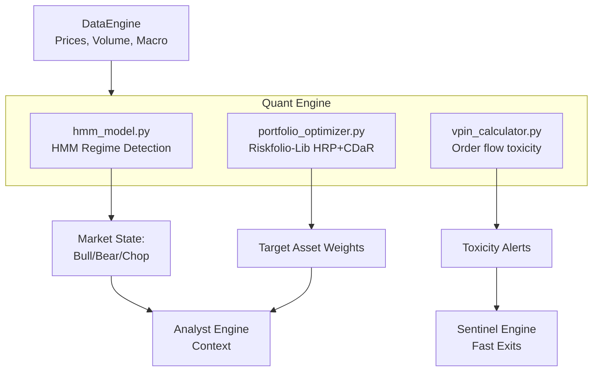

# Phase 2: Quant Engine — Build Plan

## Goal Description
The **Quant Engine** is the mathematical core of the Aegis system. It has three primary responsibilities:
1. **Regime Detection:** Determine if the market is in a Bull, Bear, or Volatile state using Hidden Markov Models (HMM).
2. **Portfolio Optimization:** Allocate capital dynamically using Hierarchical Risk Parity (HRP) and Conditional Drawdown at Risk (CDaR) constraints, discarding simplistic static weightings.
3. **Order Flow Toxicity (VPIN):** Measure the Volume-Synchronized Probability of Informed Trading to flag when institutional dumping is occurring before price fully reacts.

All components will pull data exclusively through the existing `DataEngine`.

## User Review Required
No immediate changes to API keys are needed, as this relies on the data ingestion engine. I will install the advanced mathematical libraries (`hmmlearn`, `riskfolio-lib`). Please review this architecture below before we start building.

---

## Architecture

## Proposed Changes

### Quant Engine Module
I will create the following new files to build the engine:

#### [NEW] engines/quant/base_quant_model.py
An abstract base class for quant models, establishing a standard interface for training and inference endpoints.

#### [NEW] engines/quant/hmm_model.py
Implements `hmmlearn.GaussianHMM` to detect market regimes. 
- Input: SPY daily returns, VIX levels (from `DataEngine`).
- Output: Probabilities of discrete hidden states mapped to Market Regimes.

#### [NEW] engines/quant/portfolio_optimizer.py
Implements `riskfolio-lib`.
- Input: Historical price matrix of the current portfolio universe.
- Output: Optimal weight allocations calculated via Hierarchical Risk Parity (HRP).

#### [NEW] engines/quant/vpin_calculator.py
Calculates Volume-Synchronized Probability of Informed Trading.
- Input: High-resolution price/volume data (from Alpaca or yfinance intraday).
- Output: VPIN metric flagging toxic order flow.

## Verification Plan

### Automated Tests
1. **Mock Data:** I will write `pytest` unit tests parsing synthetic DataFrames into each component to verify mathematical outputs without API calls.
2. **HMM Validation:** Feed a known period of extreme volatility (e.g., March 2020) and verify the HMM correctly transitions to the Bear/High-Vol state.
3. **Optimization Validation:** Provide 5 uncorrelated assets and verify Riskfolio-Lib allocates to risk parity constraints correctly.

### Output Integration
Verify that the outputs dictionary matches the expected schema needed by the subsequent Analyst and Sentinel Engines.
