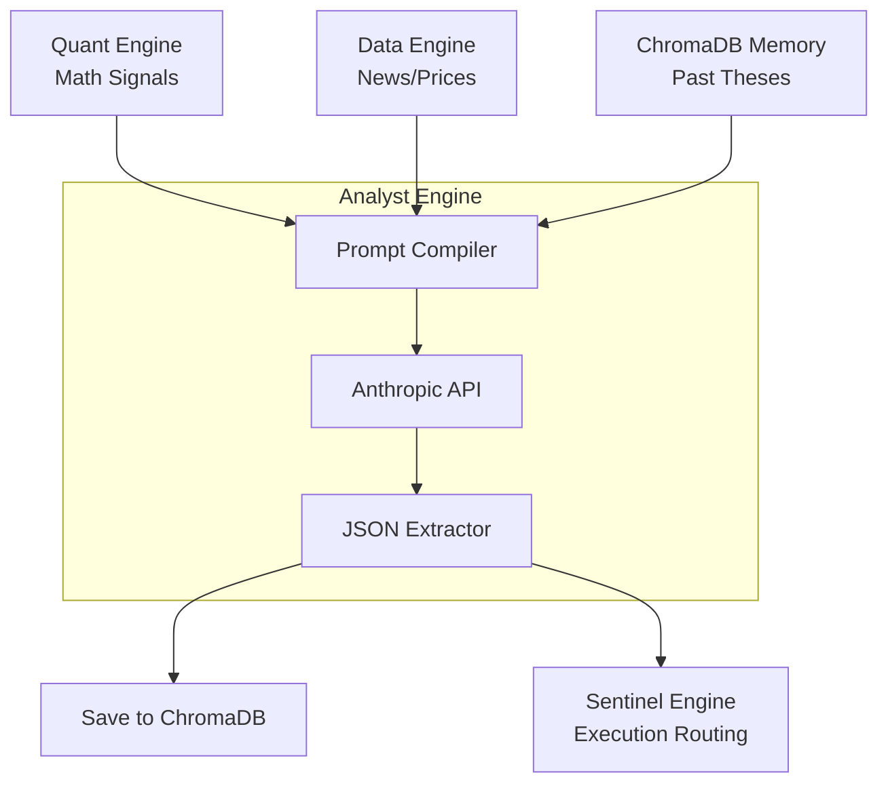

# Phase 3: Analyst Engine — Build Plan

## Goal Description
The **Analyst Engine** (System 3) is the cognitive reasoning core of Aegis AI. While the Data Engine gathers raw facts and the Quant Engine calculates strict mathematical bounds, the Analyst Engine uses a Large Language Model (Anthropic Claude 3.5 Sonnet) to synthesize all of these raw signals into a coherent, human-readable investment thesis.

It also serves as the system's "memory" by embedding generated reports and retrieving past thoughts using **ChromaDB** to ensure longitudinal awareness (e.g., "Last week I was bullish on AAPL, but the new VPIN toxicity flag contradicts my prior thesis").

## 🧠 Component 1: Thesis Generator (`engines/analyst/thesis_generator.py`)

### Architecture
We will use the generic `anthropic` Python SDK rather than heavier abstractions like LangChain to preserve speed and exact prompt string control.

- **Inputs:** A structured dictionary containing all recently calculated state:
  - `DataEngine` snapshot (current prices, P/E ratios, FinBERT news sentiment scores)
  - `QuantEngine` snapshot (current HMM regime, HRP target weight for the ticker, Chronos price bounds, VPIN toxicity warning).
- **Methodology:** 
  1. Construct an extensive System Prompt dictating rigid Persona boundaries (a cold, mathematical, institutional quantitative analyst).
  2. Inject the data snapshots as the user message.
  3. Require the LLM to output a strictly formatted JSON structure (using Anthropic Tool Calling / Structured Outputs) containing:
     - `action`: "BUY", "SELL", or "HOLD"
     - `confidence`: Int (1-10)
     - `reasoning`: A concise 2-paragraph narrative explaining *why* the math supports the action.
     - `key_drivers`: Array of the top 3 signals that influenced the decision.

### Testing Plan (`tests/unit/test_thesis_generator.py`)
- Pass an artificially highly-bullish dummy state (Bull Regime, high FinBERT sentiment, low VPIN, high Chronos prediction) to the generator.
- **Assertion:** The generator completes the API call without returning an error, securely parses the LLM output into a Python dictionary, and correctly concludes an `action` of "BUY" with high `confidence`.

---

## 💾 Component 2: Vector Memory Bank (`engines/analyst/chroma_memory.py`)

### Architecture
Aegis needs to remember what it thought yesterday to prevent bipolar trading behavior today. We will integrate `chromadb` to store and retrieve past thesis objects.

- **Storage Structure:** 
  - Collection Name: `aegis_theses`
  - Document: The raw `reasoning` string generated by the LLM.
  - Metadata: `{"ticker": "AAPL", "date": "2025-01-01", "action": "BUY", "confidence": 8}`
  - ID: sha256 hash or deterministic combination of `ticker` + `timestamp`.
- **Methodology:**
  - `ChromaMemory.save_thesis(ticker, thesis_dict)`: Embeds and stores the log locally in SQLite-backed Chroma storage (`/tmp/aegis_chroma_db`).
  - `ChromaMemory.recall_thesis(ticker, limit=3)`: Retrieves the most recent N theses for a specific ticker to feed *back* into the Thesis Generator's context window on the next iteration.

### Testing Plan (`tests/unit/test_chroma_memory.py`)
- Instantiate an ephemeral local Chroma cluster.
- Insert 3 mock thesis generations for "NVDA" with sequential dates.
- Query the cluster for "NVDA".
- **Assertion:** Ensure the length of the retrieved documents is 3, that the metadata is correctly formatted, and that documents can be successfully retrieved chronologically.

---

## Architecture Context

## Proposed Changes
1. Install `anthropic` and `chromadb`.
2. Create `engines/analyst/thesis_generator.py` and `tests/unit/test_thesis_generator.py`.
3. Create `engines/analyst/chroma_memory.py` and `tests/unit/test_chroma_memory.py`.
4. Run integration validation to ensure Claude successfully interprets a real payload.
