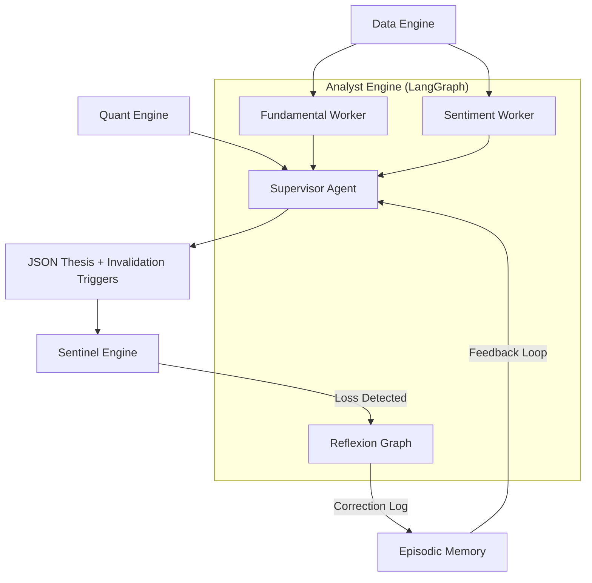

# Phase 3: Analyst Engine — Build Plan

## Goal Description
The **Analyst Engine** (System 3) is the cognitive reasoning core of Aegis AI. It transitions the system from a "feed-forward" pipeline into a self-reflecting, autonomous portfolio manager. It leverages Multi-Agent topology, structured Episodic Memory, and Natural Language Inference (NLI) to synthesize context, generate theses, learn from lost trades, and emit semantic invalidation limits.

All LLM logic is structured via `langgraph`, and the system is strictly built on open-source, local-first capabilities.

---

## 🧠 Component 1: Multi-Agent RAG Supervisor (`engines/analyst/supervisor.py`)

### Architecture
We will use the `langchain-ai/langgraph` framework to implement a Hierarchical Agentic Supervisor. Massive documents (10-Ks, scripts) crash local context windows.

- **Supervisor Agent (Claude Haiku 4.5 or 3.5 Sonnet):** Extremely fast, cheap. Its only job is to read the user/system prompt, analyze the Quant bounds, and route data-heavy sub-tasks.
- **Worker Agents (Local Models e.g., Ollama Llama-3-8B):** Invoked by the Supervisor to process heavy text. 
  - *Fundamental Reader:* Chunks 10-Ks using `MarkdownHeaderTextSplitter` (keeping sections intact) and runs RAG queries for precise CAPEX or risk outlooks.
  - *Sentiment Analyst:* Evaluates specific FinBERT outliers.
- **Output Synthesis:** The Supervisor takes the Workers' concise outputs, combines them with the mathematical state from the Quant Engine (HMM, HRP, VPIN, Chronos bounds), and outputs a strict JSON thesis:
  - `action`: BUY/SELL/HOLD
  - `confidence`: 1-10
  - `reasoning`: 2-paragraph narrative.
  - `invalidation_trigger`: Natural language limit (e.g., "Invalidate if SEC files antitrust suit").

---

## 💾 Component 2: Episodic Memory Bank (`engines/analyst/episodic_memory.py`)

### Architecture
Standard vector search finds keywords, not context. We will explicitly wrap `ChromaDB` (or integrate a lightweight version of `Mem0`) to act as the agent’s OS-level memory, enforcing strict metadata schemas.

- **Schema:** 
  - `content`: The generated thesis or Correction Log.
  - Metadata partition tags: `regime` (Volatile/Bull/Bear), `sector`, `outcome` (Win/Loss).
- **Retrieval Workflow:** Before generating a new thesis for a Tech stock in a Volatile regime, the Analyst explicitly queries ChromaDB for `{"sector": "Tech", "regime": "Volatile", "outcome": "Loss"}` and injects its *past correlated mistakes* directly into the system prompt to prevent repeating them.

---

## ⚡ Component 3: Semantic NLI Cross-Encoder (`engines/sentinel/semantic_trigger.py`)

### Architecture
It is too slow/expensive to run generative LLMs over every incoming live news headline to check against the Analyst's `invalidation_trigger`.

- **Model:** Local HuggingFace Cross-Encoder (`cross-encoder/nli-deberta-v3-base`).
- **Processing:** The Sentinel passes the Analyst's trigger (Premise) and the live news headline (Hypothesis) together.
- **Execution:** The Cross-Encoder outputs an entailment score. If `score > 0.85`, the Sentinel instantly triggers an API sell order.

---

## 🔄 Component 4: Post-Mortem Reflexion Graph (`engines/analyst/reflexion.py`)

### Architecture
A dedicated LangGraph workflow triggered by the Sentinel when a trade closes at a loss.

- **Actor (Local):** Pulls the original JSON thesis and the actual failed price chart.
- **Evaluator (Claude):** Checks the logic flaw against the historical outcome.
- **Reflector:** Generates a "Correction Log" (e.g., "Ignored toxic flow warning during earnings week").
- **Injection:** Saves this Log to the Episodic Memory Bank tagged with `outcome="Loss"`, actively permanently altering the system's baseline behavior.

---

## Architecture Context

## Proposed Changes
1. Initialize the `engines/analyst` directory.
2. Build the Episodic Memory layer first (`episodic_memory.py`) so the agent has a hippocampus.
3. Build the NLI Semantic Trigger class.
4. Construct the LangGraph Supervisor topology.
5. Create rigorous pytest suites for memory recall accuracy and NLI entailment scores.
