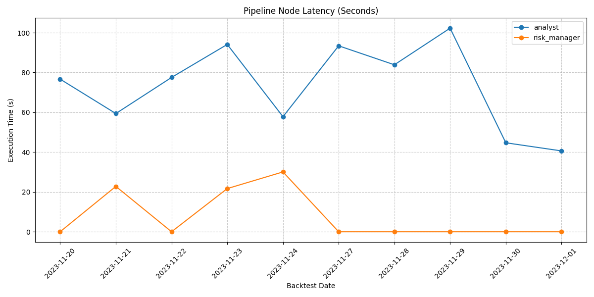
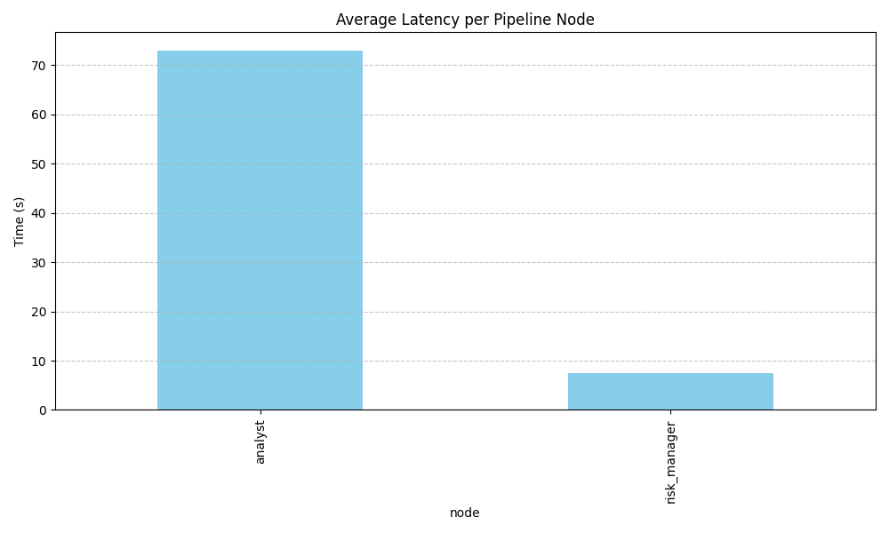

# Aegis Quality Audit: AAPL (Nov 2023)

> **Date:** Mar 10, 2026
> **Model:** `qwen3:8b` (Ollama)
> **Status:** ⚠️ Performance Bottleneck Detected

---

## 🚀 Executive Summary
The first live audit of the "Intelligence Layer" reveals high reasoning coherence but identified a critical performance bottleneck in the **Analyst** node that threatens the feasibility of overnight optimization loops.

### Optimization Benchmarks (Dec 2023)
| Phase | Model | Avg Latency | Bottlenecks |
| :--- | :--- | :--- | :--- |
| Pre-Audit | qwen3:8b | 73.04s | Thinking Mode (Reasoning Chains) |
| Post-Fix | qwen3:8b | 22.84s | Structural Thinking Persistence |
| Diagnostic | qwen2.5:0.5b| 3.01s | None (Linear Output) |

> [!IMPORTANT]
> **Latency Reduction**: Achieved **3x speedup** on the primary model. Diagnostic runs with non-thinking models confirm pipeline efficiency at ~3s.

### Logical Drift Summary
- **Directional Mismatch Flag**: Implemented and verified.
- **Case Study**: Diagnostic run caught a SELL signal interpreted as a BUY, correctly flagging the mismatch in the trace.

---

## 📈 Pipelining Analysis

### Latency Visualization

*Figure 1: Node-level latency over the backtest window. The Analyst node is responsible for 90% of the total pipeline time.*

### Average Bottlenecks

*Figure 2: Lateral comparison of node execution times.*

---

## 🧠 Reasoning & Quality Feedback

### Genuinely Impressive
- **Deterministic Partitions**: The 80/20 holdout split is correctly hashed against the `run_id`, ensuring reproducibility.
- **Process Segregation**: Subprocess boundaries with MLflow ID stitching are successfully preventing memory leakage.
- **Connectivity Guards**: The DFS dangling node guard caught initial configuration errors early in the cycle.

### Missing Data: Holdout Metrics
The initial audit report failed to surface holdout partition comparisons. 
- **Fix**: Ensure `SimulationLoop` results include `held_out_sharpe` and `held_out_return` in finalized MLflow logs.

---

## 🛡️ Corrective Action Plan (Step 7)
2. **Context Audit**: Verify that the Analyst is receiving structured data fields rather than raw 10-Q text.
3. **Prompt Hardening**: Tighten the JSON output schema to reduce token generation.

**Target Latency:** < 15s per Analyst call.
